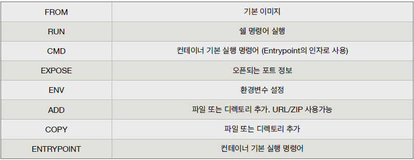
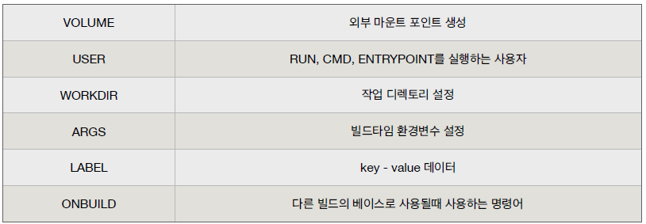

# 도커 - 이미지 만들고 배포하기

## 이미지란

- 도커는 레이어드 파일 시스템 기반
- 이미지는 프로세스가 실행되는 파일들의 집합(환경)
- 프로세스는 환경(파일)을 변경할 수 있음
- 이 환경을 저장해서 새로운 이미지를 만든다 


### 깃 설치

```bash
$ docker run -it --name git ubuntu:latest bash

# apt-get update
# apt-get install -y git
# git --version
```


### 깃 설치한 이미지로 컨테이너 생성

```bash
$ docker run -it --name git2 ubuntu:git bash
```


### 도커 이미지 만들기

```bash
docker build -t <이름>/<이미지 이름>:<태그> .
docker build -t sangjinsu/ubuntu:git01 .
```


- 현재 디렉토리의 Dockerfile 로 빌드
  - `-f <Dockerfile 위치> 옵션` 을 사용해 다른 위치의 Dockerfile 파일 사용 가능
  - `-t` 명령어로 도커 이미지 이름을 지정
  - `{네임스페이스}/{이미지이름}:{태그}` 형식


### 도커 이미지 만들기 명령어






### 도커 이미지 만들기 - 웹 애플리케이션

```dockerfile
# 1. node 설치
FROM    ubuntu:20.04
RUN     apt-get update
RUN     DEBIAN_FRONTEND=noninteractive apt-get install -y nodejs npm

# 2. 소스 복사
COPY    . /usr/src/app

# 3. Nodejs 패키지 설치
WORKDIR /usr/src/app
RUN     npm install

# 4. WEB 서버 실행 (Listen 포트 정의)
EXPOSE 3000
CMD    node app.js
```


### v2 node 버전 변경 및 이미지 재사용

```dockerfile
# 1. node 이미지 사용
FROM    node:12

# 2. 소스 복사
COPY    . /usr/src/app

# 3. Nodejs 패키지 설치
WORKDIR /usr/src/app
RUN     npm install

# 4. WEB 서버 실행 (Listen 포트 정의)
EXPOSE 3000
CMD    node app.js
```


#### v3

```dockerfile
# 1. node 이미지 사용
FROM   node:12

# 2. 패키지 우선 복사
COPY    ./package* /usr/src/app/
WORKDIR /usr/src/app
RUN     npm install

# 3. 소스 복사
COPY . /usr/src/app

# 4. WEB 서버 실행 (Listen 포트 정의)
EXPOSE 3000
CMD    node app.js
```


#### v4

```dockerfile
# 1. node 이미지 사용
FROM    node:12-alpine

# 2. 패키지 우선 복사
COPY    ./package* /usr/src/app/
WORKDIR /usr/src/app
RUN     npm install

# 3. 소스 복사
COPY . /usr/src/app

# 4. WEB 서버 실행 (Listen 포트 정의)
EXPOSE 3000
CMD    node app.js
```


---


### From

```dockerfile
FROM [--platform=<platform>] <image>[:tag] [AS <name>]

# 베이스 이미지 지정
# FROM ubuntu:latest
# FROM node:12
# FROM python:3
```


### COPY

```dockerfile
COPY [--chown=<user>:<group>] <src>... <dest>

# 파일 또는 디렉토리 추가
# COPY index.html /var/www/html/
# COPY ./app /usr/src/app
```


### RUN

```dockerfile
RUN <command>

# 명령어 실행
# RUN apt-get update
# RUN npm install
```


### WORKDIR

```dockerfile
WORKDIR /path/to/workdir

# 작업 디렉토리 변경
# WORKDIR /app
```


### EXPOSE

```dockerfile
EXPOSE 3000

# 컨테이너에서 사용하는 포트 정보
# EXPOSE 8000
```


### EXPOSE

```dockerfile
CMD ["executable","param1","param2"]
CMD command param1 param2

# 컨테이너 생성시 실행할 명령어
# CMD ["node", "app.js"]
# CMD node app.js
```


## 도커 허브 이미지 관리

#### 이미지 저장 명령어

- docker login
- docker push {ID}/example
- docker pull {ID}/example


## 배포하기

```bash
docker run -d -p 3000:3000 subicura/app

# 컨테이너 실행 = 이미지 pull + 컨테이너 start
```